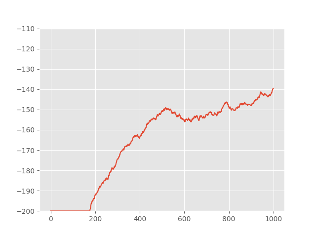
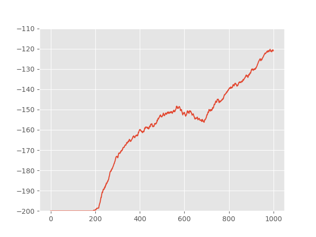
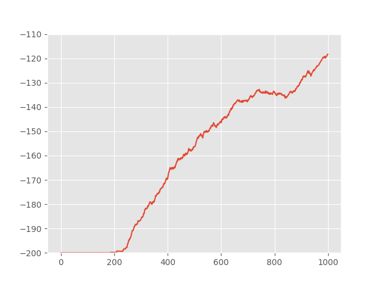
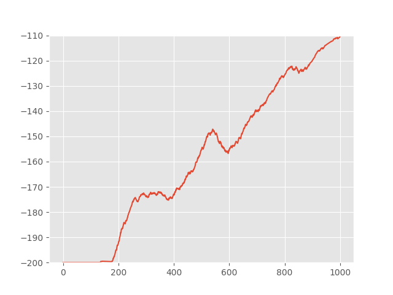
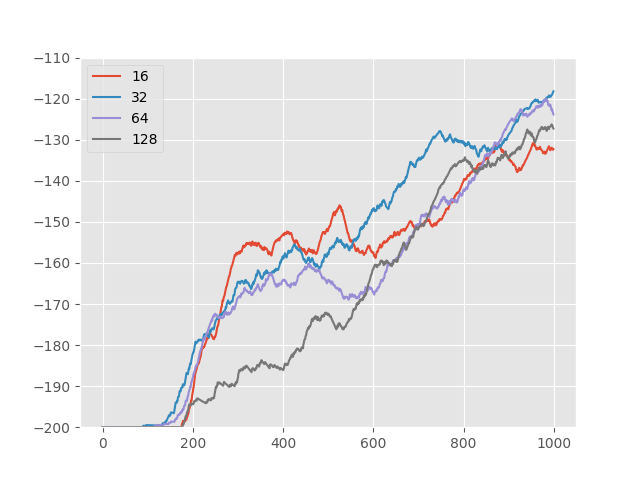
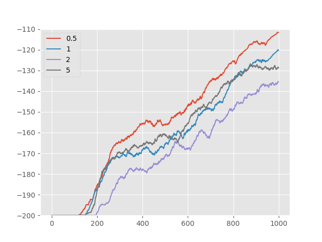
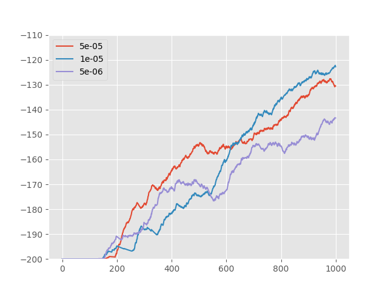
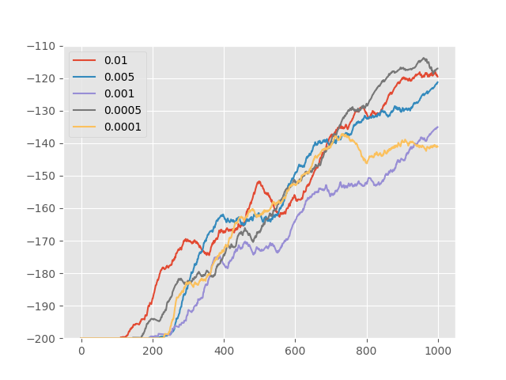

# README:  Intrinsic Rewards with Contrastive Random Walk 

## 1. Overview

Reinforcement learning (RL) learns policies that maximize the reward given by the environment. Methods considering only the environment rewards work well when rewards are dense. However, when the rewards are sparse, exploration has been proven important to make faster convergence of finding optimal policy. In the past few decades, dozens of methods have been proposed to encourage exploration by introducing an exploration bonus as an intrinsic rewards, which decides based on the chosen time of a certain state.

With the advance of RL, people are interested in applying it to more complicated scenarios, where the observations are some high-dimensional signals (e.g. video frame). To understand the signals and better define states, instead of human definition, features extracted by neural networks are applied to represent states. It provokes two notable changes in the definition of states: states become high-dimensional and state are no longer invariant to observations. These changes makes counting the visits to certain states unavailable.

To deal with the problem that traditional exploration rewards can’t use in complicated environment, researchers propose the concept of curiosity and use neural network loss as rewards. Neural networks are good at understanding high-dimensional signals and have astonishing generalization ability, which perfectly fits the scenario. The loss of neural networks can be viewed as a pseudo-count, that is lower when the state is frequently visited and higher for unvisited states.

However, two problems remain with many existing curiosity methods. On one hand, many of the methods lacks mathematical foundations. The intuition of why these methods work is unclear. On the other hand, neural networks in most curiosity methods neural networks only serve as function fitters and are not extracting meaningful features. We argue that these neural networks can also help build a better state encoder if properly designed. Good state representations can thus further leverage the generalization ability of neural networks and implicitly create a good clustering of observations. Such clusters can well define curiosity for similar observations, i.e. intrinsic rewards will not decrease when seeing exactly the same observations, but will also decrease for similar states. More meaningful representations will be better at define what is ”similar”.
	

To tackle these two problems, we proposed applying Contrastive Random Walk (CRW) as a curiosity method. CRW can extract meaningful representations from time series by creating a closed-loop for the series. In RL, experience is naturally a time series and hence CRW could also be able to extract good state representations. Meanwhile, we provide a mathematical proof that the loss of CRW is a good approximation to the information gain, which is a good measurement of how visited a state is.

​	

We tested our method on two environments: ”MountainCar-v0” and ”Montezuma’s Revenge”. Both environments has sparse environment rewards and thus good exploration strategies are critical to ensure a faster convergence of policy. Meanwhile, both environments use neural networks to get state representations. MountainCar-v0 is a simple environment that the agent’s task is to reach the top of the mountain within less time. The observation is some attributes of the car, including speed and position. While Montezuma’s Revenge is a more complicated environment... The observation is just video frames. Our method has obtained better performance than all the other baselines, including curiosity method, count-based method, and randomized strategy.

## 2. Results

Here we report the performance of our CRW and other baselines. Our methods reaches a final episode running reward of -110.607, which greatly surpasses all the other baselines, where epsilon greedy achieves -139.57, UCB achieves -121.037 and RND achieves -118.297. Meanwhile, we also observe that our methods begins to have rewards earlier than other networks. This phenomena shows that our method wastes less efforts on testing a similar states, which benefits the convergence speed.

<caption>Epsilon Greedy</caption>

<caption>Upper Confidence Bound</caption>

<caption>Random Networks Distillation</caption>

<caption>Contrastive Random Walk</caption>

## 3. Usage

The training process will begin by calling `train.py` using the default hyperparameters. It has one arguments called `methods`, which can be chosen from `crw`, `rnd`, `ucb` and `greedy`.  The default `methods` is set as `crw` . For changing hyperparameters, you can go and change the corresponding `train_*.py` files.

## 4. Ablation Study

Here we show how each hyperparameter will contribute to the final results of our methods in Figure \ref{fig: Ablation}. The hyper-parameter tuned including feature dimension of the state encoder, temperature of crw, batch size during training and learning rate. Except for the parameter of being tuned, other parameters are set as default.

<caption>Tuning feature dimension of the state encoder</caption>

<caption>Tuning feature dimension of the temperature</caption>

<caption>Tuning learning rate of the state encoder</caption>

<caption>Tuning restart running loss ratio</caption>

## 5. Credit

This repo is implemented based on **https://github.com/alirezakazemipour/DDQN-Random-Network-Distillation/**